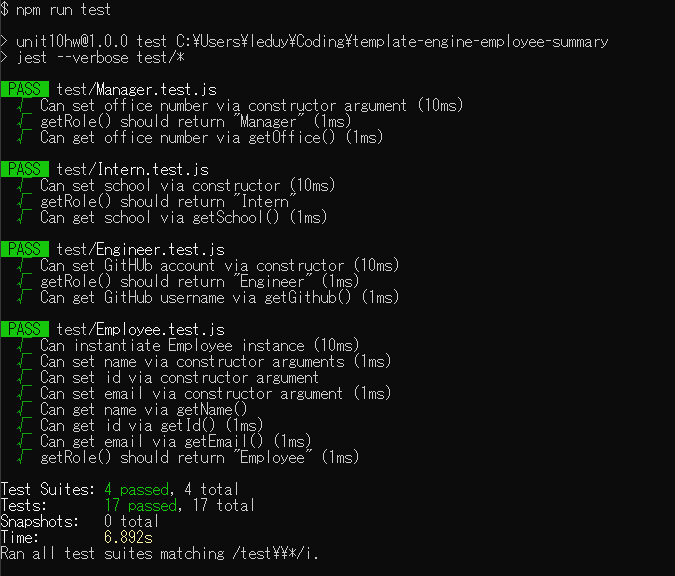
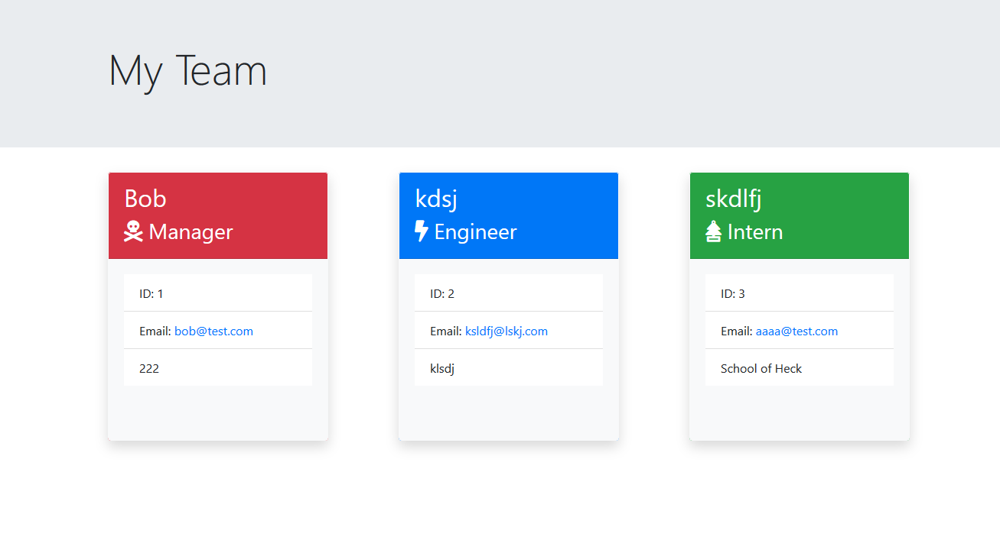

# Template Engine - Employee Summary
A Node CLI that takes employee information and generates an HTML summary page

## Approach
Breaking down the requirements, I separated out the objective into the following parts:
1. Define a constructor for the base employee, then extend it into the three employee types
2. Create html templates for each employee type
3. Using the command line, prompt the team leader to enter their information
4. Once the team leader is added, begin adding team members
5. Using the list of team members, generate the html page containing all members of the team

## Sample Usage

## Test Suite

## Sample Output
